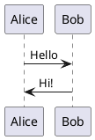

# markdown-plantuml


```plantuml
@startuml firstDiagram

Alice -> Bob: Hello
Bob -> Alice: Hi!
		
@enduml
```

It will be rendered:

<div hidden>
```
@startuml firstDiagram

Alice -> Bob: Hello
Bob -> Alice: Hi!
		
@enduml
```
</div>


